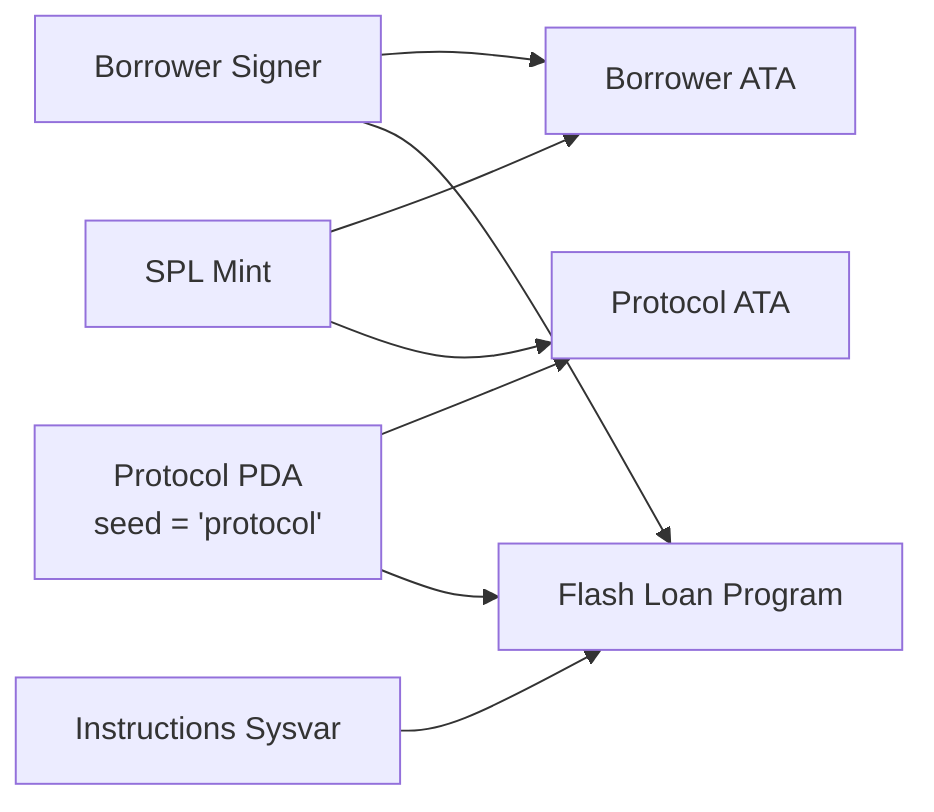
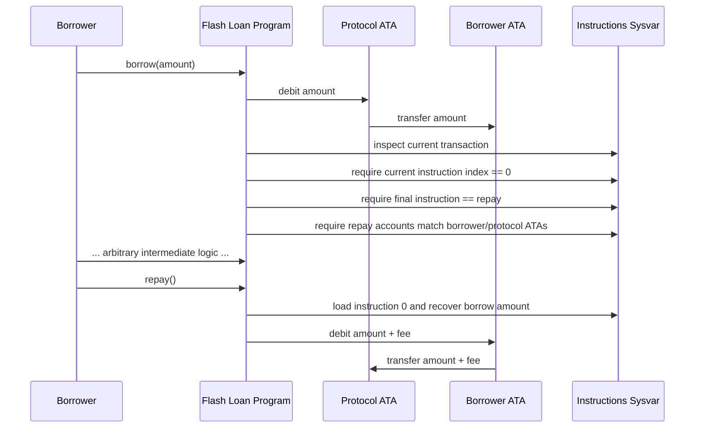

# Flash Loan 

This repository implements a flash loan protocol in Anchor.

It is not a general-purpose lending market. It is a narrowly scoped protocol that demonstrates one core primitive:

- lend tokens out of a protocol-owned vault
- require repayment in the same transaction
- charge a fixed fee
- reject transactions that do not satisfy the expected borrow/repay shape

The design is intentionally compact so the important ideas stay visible:

- PDA-controlled token authority
- account constraints for token accounts
- instruction introspection through the instructions sysvar
- atomic flash loan repayment guarantees

## What the Protocol Does

The program exposes two instructions:

1. `borrow(borrow_amount: u64)`
2. `repay()`

The intended transaction shape is:

1. `borrow` is the first instruction in the transaction
2. user runs arbitrary intermediate logic with the borrowed liquidity
3. `repay` is the last instruction in the transaction

If the repay leg is missing or does not match the expected accounts, the transaction should fail and the entire borrow is rolled back atomically by Solana.

## Mental Model

This protocol is best understood as a transaction validator around a token transfer.

The actual asset movement is simple:

- `borrow` transfers tokens from the protocol vault to the borrower token account
- `repay` transfers `borrow_amount + fee` back from the borrower token account to the protocol vault

The real complexity is not the transfer. The complexity is proving, inside the transaction, that repayment is also present and points at the right accounts.

## High-Level Architecture



## Transaction Lifecycle



## Account Model

### `borrower`

The end user and transaction signer.

- pays rent if `borrower_ata` must be created
- signs the overall transaction
- acts as authority over `borrower_ata` during `repay`

### `protocol`

A PDA derived from:

```text
seed = "protocol"
```

This PDA is the authority over the protocol vault token account.

The PDA never signs with a private key. It signs through seeds:

```rust
let seeds = &[b"protocol".as_ref(), &[ctx.bumps.protocol]];
let signer_seeds = &[&seeds[..]];
```

That is what authorizes the outbound transfer during `borrow`.

### `mint`

The SPL token mint that the flash loan operates on.

The current program is single-mint per instruction invocation, not a pooled multi-asset engine.

### `borrower_ata`

The borrower’s associated token account for `mint`.

Behavior:

- created lazily with `init_if_needed`
- receives the borrowed amount during `borrow`
- sends `principal + fee` back during `repay`

### `protocol_ata`

The protocol vault token account for `mint`, owned by the `protocol` PDA.

Behavior:

- must already exist
- must already be funded
- is the source of liquidity for `borrow`
- receives the repayment plus fee

### `instructions`

The Solana instructions sysvar.

This is the mechanism that makes the protocol “flash” rather than “deferred”.

The program inspects the full transaction to prove:

- `borrow` is first
- `repay` is last
- the repay instruction belongs to this same program
- the repay instruction points to the same borrower and protocol token accounts

## Borrow Flow

### Step 1: Reject invalid amount

The program rejects `borrow_amount == 0`.

Why it matters:

- a zero-value flash loan is meaningless
- edge cases are easier to reason about when input is constrained

### Step 2: Sign for the protocol PDA

The protocol vault is controlled by a PDA, so the program constructs signer seeds and performs a CPI to the SPL token program.

### Step 3: Transfer liquidity out

The protocol moves `borrow_amount` from:

- `protocol_ata`

to:

- `borrower_ata`

### Step 4: Inspect the enclosing transaction

The program loads the instructions sysvar and enforces the transaction envelope:

- current instruction index must be `0`
- last instruction must exist
- last instruction must be `repay`
- last instruction must target the same token accounts

Without these checks, the borrow would simply be an unsecured token transfer.

## Repay Flow

### Step 1: Read the first instruction

The program reads instruction `0` from the instructions sysvar and extracts the encoded `borrow_amount` from bytes `8..16`.

Why bytes `8..16`:

- Anchor instruction data begins with an 8-byte discriminator
- `borrow` then encodes its first argument, `u64 borrow_amount`

So:

- bytes `0..8` = `borrow` discriminator
- bytes `8..16` = `borrow_amount`

### Step 2: Compute fee

The program charges a hardcoded fee of `500` basis points:

```text
500 / 10_000 = 5%
```

Repayment obligation:

```text
repay_amount = borrow_amount + fee
```

### Step 3: Transfer funds back

The borrower transfers `repay_amount` from:

- `borrower_ata`

to:

- `protocol_ata`

The borrower signs this leg because the borrower owns the borrower ATA.

## Security Invariants

The program is trying to enforce these invariants:

1. No zero-amount borrow
2. Borrow can only happen from the protocol PDA vault
3. Borrow must be the first instruction
4. Repay must be the last instruction
5. Repay must belong to the same program
6. Repay must target the same borrower ATA
7. Repay must target the same protocol ATA
8. Repayment amount is deterministically derived from the borrow amount plus fee

## Why Instruction Introspection Matters

Without instruction introspection, the program would have no idea whether repayment is present elsewhere in the same transaction.

On Solana, every instruction in a transaction either commits together or rolls back together.

That means the program can safely do this pattern:

1. send tokens out now
2. prove that the transaction also contains a valid repay later
3. rely on transaction atomicity to revert everything if repay fails

That atomic property is the core reason flash loans are practical on Solana.

## Current Implementation Caveats

This repository follows the challenge-oriented design, not a production-hardening pass.

Important caveats:

1. There is no explicit initialize/admin instruction for provisioning the protocol vault.
   The PDA vault must be created and funded externally.

2. `repay()` reads instruction `0` and slices bytes `8..16` directly.
   It assumes the first instruction is a correctly encoded `borrow`.

3. The current `repay()` implementation does not independently verify that instruction `0` is:
   - from this program
   - specifically the `borrow` instruction

   In practice, `borrow()` enforces the intended transaction shape, but `repay()` itself is less defensive than a production-grade implementation should be.

4. Fees are hardcoded to 5%.
   There is no governance or configuration account.

5. The program is single-vault, single-PDA, instruction-scoped logic.
   It is not yet a generalized lending engine.

These caveats are acceptable for a learning challenge, but they should be addressed before treating this as production code.

## Test Strategy

This repository uses two complementary testing paths:

### 1. Rust unit/build verification

`cargo test`

This verifies:

- the program compiles
- Anchor macros expand correctly
- the crate remains structurally healthy during refactors

### 2. TypeScript integration tests with `anchor-litesvm`

The `tests/` suite uses:

- `anchor-litesvm`
- `litesvm`
- `@coral-xyz/anchor`
- `@solana/spl-token`

This gives a fast in-process test VM with an Anchor-friendly provider interface.

The tests exercise:

1. successful borrow + repay round trip
2. fee capture by the protocol vault
3. invalid zero-amount borrow rejection
4. invalid final-instruction rejection when a transaction ends with `borrow` instead of `repay`
5. mismatched repay account rejection
6. standalone repay failure behavior

## Running the Project

### Build the program

```bash
anchor build --ignore-keys
```

The `--ignore-keys` flag is used because this repo follows the fixed Blueshift challenge program ID.

### Run Rust checks

```bash
cargo test
```

### Run TypeScript LiteSVM tests

```bash
npm run test:ts
```

## Repository Layout

```text
programs/flash_loan/src/lib.rs
programs/flash_loan/src/error.rs
programs/flash_loan/src/instructions.rs
programs/flash_loan/src/instructions/borrow.rs
programs/flash_loan/src/instructions/repay.rs
tests/flash_loan.spec.ts
```

## Design Summary

This protocol is small, but it captures a real pattern:

- vault authority is a PDA
- liquidity leaves before user logic finishes
- repayment is enforced by transaction introspection
- atomicity is the security boundary
